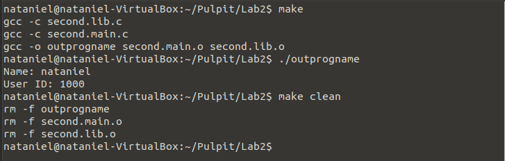

# Lab 2

## General info
A simple application using getutxent and getpwnam functions along with utmpx structure.
Two programs display the currently logged in users and give the UID of the log in user. 
File "first" don't have makefile.
The second program is split into two files, one contains the whole function and the other contains its calls.

## Program is created with:
* C

## Setup
To run this program:

```
$ gcc -o out first.c
$ ./out
```

## Terminal display

