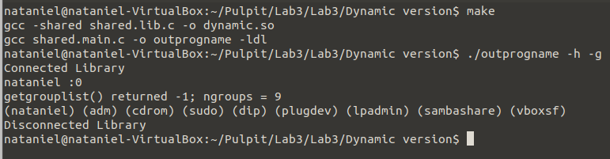

# Dynamic Version

## General info
The program dynamically loads (using the dlfcn library function) a previously prepared shared library and imports the function it provides. 

## Program is created with:
* C

## Setup
To run program:
### No switch
```
$ make
$ ./outprogname
```
### Switch h
```
$ make
$ ./outprogname -h
```
### Switch g
```
$ make
$ ./outprogname -g
```
### Switch h and g
```
$ make
$ ./outprogname -h -g
```

## Terminal display

