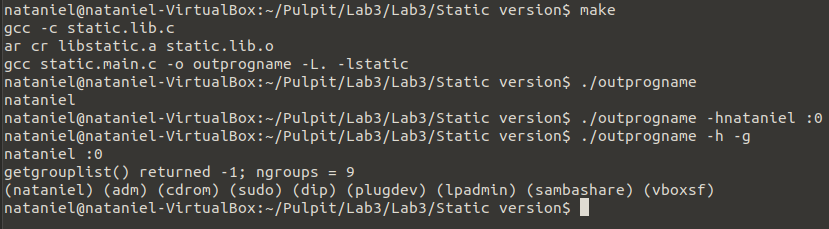

# Static Version

## General info
In this version we use the static library.

## Program is created with:
* C
* Makefile

## Setup
To run program:
### No switch
```
$ make
$ ./outprogname
```
### Switch h
```
$ make
$ ./outprogname -h
```
### Switch g
```
$ make
$ ./outprogname -g
```
### Switch h and g
```
$ make
$ ./outprogname -h -g
```

## Terminal display

