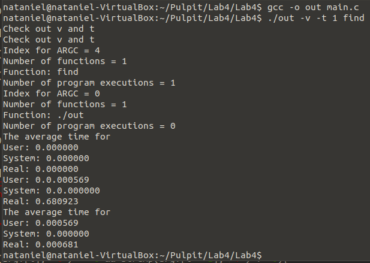

# Lab 4

## General info
The program is used to call as many functions in the terminal as the user wants. It makes time calculations and at the end it takes the average of all the results. 
I use 'execve' to call a function and 'wait4' to wait for that function to be called. The program in the main loop creates processes for the number of function calls.
## Program is created with:
* C

## Setup
To run program:

### Switch v and t
```
$ gcc -o out main.c
$ ./out -v -t 20 find
```

## Terminal display

