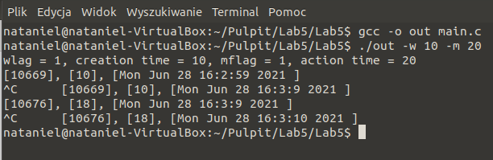

# Lab 5

## General info
The program is used to test the handling of incoming signals. The program is run with two numeric parameters:
* the maximum lifetime of child processes (seconds) 
* the interval between their creation (seconds)

I create a new process in the main loop at constant intervals. The process performs arbitrary calculations (factorial). The child process handles the SIGALRM signal. The child process displays information about itself in one column (pid, drawn value, creation time). To call SIGINT, press Ctrl-C.

## Program is created with:
* C

## Setup
To run program:
```
$ gcc -o out main.c
$ ./out -w 10 -m 20
```

## Terminal display

