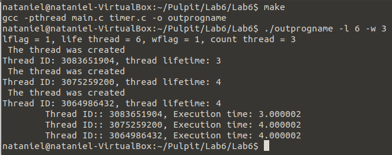

# Lab 6

## General info
A program to test memory separation across threads.
#### We run the program with two options:
* the maximum lifetime of the threads (seconds)
* amount of threads.

In the main loop, I draw the lifetime of the threads and create those threads. In the function to thread I use the start, stop functions which are declared in timer.h and the body of the function is in timer.c. The start and stop functions don't take any variables I use specific data in them so every thread can use the same functions and it won't cause any problem. 

## Program is created with:
* C
* Makefile

## Setup
To run program:
```
$ make
$ ./outprogname -l 6 -w 3
```

## Terminal display

