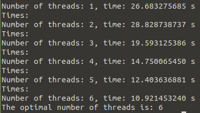

# Lab 7

## General info
The program allows you to break a chosen password stored in <b>/etc/shadow</b> using the dictionary method. We assume that in order to do so access to this file or its fragment.

### Info about first program shortcut.c
Used to learn about generating system password hashes using the crypt_r function. This function supports SHA-512 hash function cryptography (standard library version since <b>glibc 2.7</b>)

### Info about second program main.c
The second program is used to crack the password using the dictionary method. As arguments
of the call are given:
* formatted hash of the password we want to crack (e.g. extracted from <b>/etc/shadow</b> or obtained by running the first program)
* text file containing a dictionary with passwords (for testing, a file <b>tmp.txt</b> file with actual passwords coming mostly from leaks was made available for testing)
* the number of threads that will cooperate in the calculations

If you do not specify the number of threads, the program fires all possible combinations taking the maximum number of threads. It returns the times for each number of threads and prints the optimal number of threads for a given password.

## Program is created with:
* C
* Makefile

## Setup
To run program:

### shortcut.c program 
```
$ make
$ ./out2 dees
```
Or without the default salt
```
$ make
$ ./out2 dees `$6$3MfamFOsDU$` 
```

### main.c program
```
$ make
$ ./out1 -p tmp.txt -s'$6$5MfvmFOaDU$nt9YYwrJo3xoL.eJa7DdDDJVKjKUa6vn13P7WLz5dDFJnY0oCgDHdzHGCL.xroMAv6Mw74i.Rn1fEG3CGrAKx/' -i 6
```
Or without the count of threads
```
$ make
$ ./out1 -p tmp.txt -s'$6$5MfvmFOaDU$nt9YYwrJo3xoL.eJa7DdDDJVKjKUa6vn13P7WLz5dDFJnY0oCgDHdzHGCL.xroMAv6Mw74i.Rn1fEG3CGrAKx/'
```

## Terminal display 

### For shorcut.c
<p align="center">

</p>

### For main.c 
<p align="center">

</p>

Without the count of threads

<p align="center">

</p>
