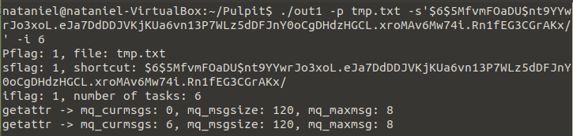
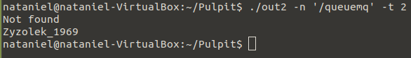
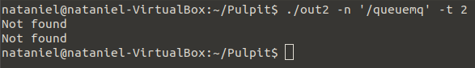
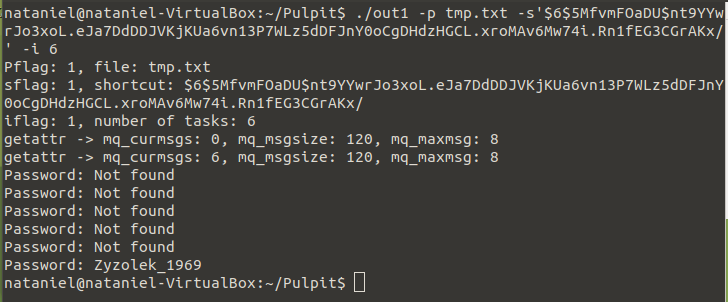

# Lab8

## General info
The main purpose of these two programs is to crack a captured password in a format accepted by crypt using the dictionary method. The way the two programs work is that they cooperate with each other by setting up multiple processes created from the two programs. For communication between the processes I used message queues and shared memory in <b>POSIX</b> version

### Info about first program manager.c
(Manager) manages the calculations:
* prepares data, i.e. reads a password file or maps it to shared memory (tmp.txt), creates a message queue
* provides shared memory
* divides a computational task into independent fragments (subtasks),
* prepares and controls the structures needed to run calculations and collect data about their progress.

### Manager run is with the following arguments:
1. the name of the password dictionary file,
2. the shortcut of the password to be broken,
3. the number of subtasks into which the entire computational task will be divided.

After the action is finished, it displays the results of the search for workers

### Info about second program worker.c
(Worker) can be started multiple times and work
in parallel in many processes. Worker performs calculations related to assigned Worker performs calculations related to subtasks assigned by the Manager. For this purpose, Worker is launched with the following options:
1. the name of the message queue,
2. number of subtasks the Worker declares to perform.

### The Worker performs the following actions:

* successively fetches subtasks for itself from the message queue and fetches as many of them as
specified in the second argument,
* performs calculations and updates data in shared memory,
* We assume that until the message is read, Worker does not know the broken hash,  the assigned passwords, or any data needed to perform the computation.

## Program is created with:
* C
* Makefile

## Setup
To run program:

first step you must run manager.c 
### manager.c program 
```
$ make
$ ./out1 -p tmp.txt -s'$6$5MfvmFOaDU$nt9YYwrJo3xoL.eJa7DdDDJVKjKUa6vn13P7WLz5dDFJnY0oCgDHdzHGCL.xroMAv6Mw74i.Rn1fEG3CGrAKx/' -i 6
```
second step run worker.c (for example three time)
```
$ make
$ ./out2 -n '/queuemq' -t 2
```

## Terminal display 

### First appearance of the manager after launching without workers
<p align="center">

</p>

### Worker 1 
<p align="center">

</p>

### Worker 2 and 3
<p align="center">

</p>

### Manager at the end of all workers
<p align="center">

</p>
