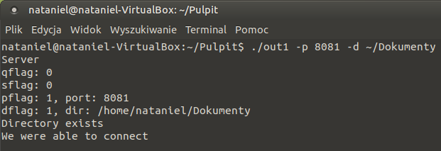
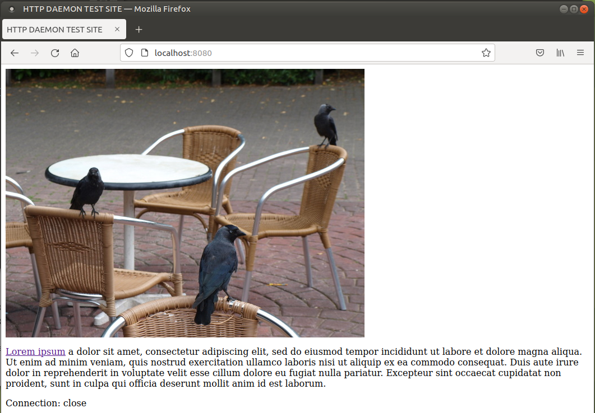
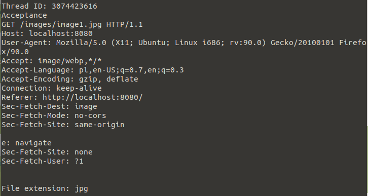
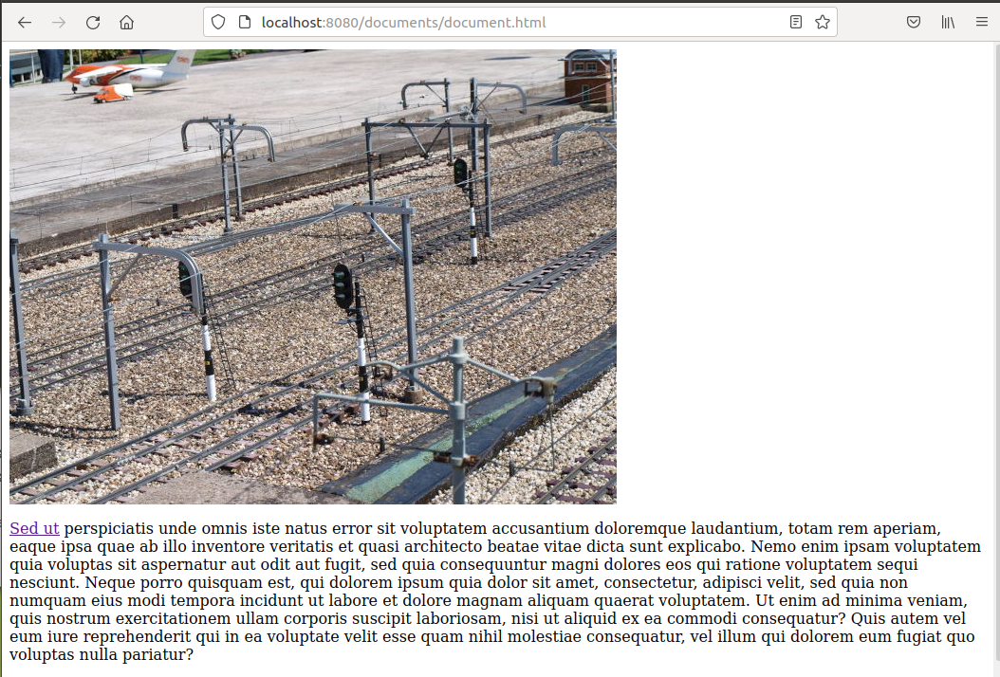
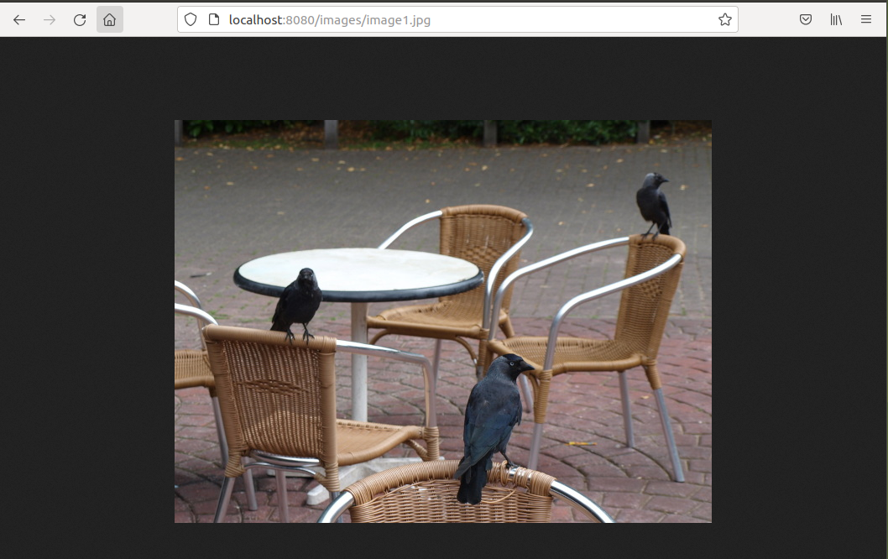
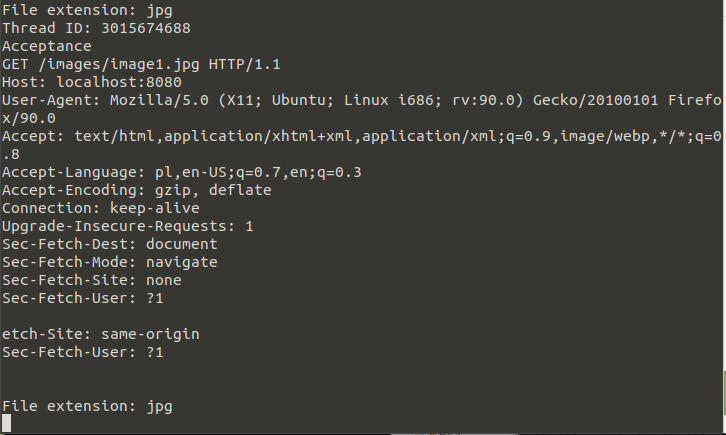
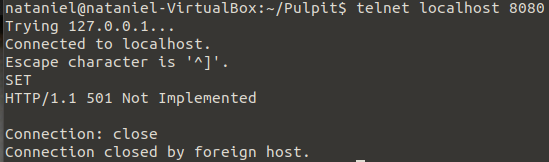

# LAB 9

## General info
The program acts as a simplified server for the HTTP.

## Info do uruchomienia server.c
1. Server start

```
./prog -p port -d dir
```

* <b>port</b> is the port number on which the server will listen;
* <b>dir</b> is the name of the directory that will serve as the server's document root.

Example: 
```
$make
$./out1 -p 8080 -d ~/Dokumenty
```
will start an http server listening on port 8080 and serving documents from the directory ~/documents.

## Program is created with:
* C
* Makefile

## Functions
1. The server supports the GET command of the http protocol version 1.1
2. responds by returning an HTTP 501 (Not Implemented) error in response to receipt of any other command
3. on command of the form GET / the program sends back a document index.html from its document root directory
4. Reports basic errors, in particular HTTP 404;
5. the program keeps a log file, in which all received requests preceded by date, time, client's IP address and result of request execution are stored in a readable form; 
6. The program starts a separate thread for each incoming connection;
7. To test the server's behavior, you can use a set of files packed in the httptest.zip archive,

## In addition
To test the server you can use a web browser or in a Linux terminal <b>telnet</b> 

### After starting the server in a new terminal, start telnet
```
$telnet localhost 8080
```

## Terminal display

### First run of the program
<p align="center">

</p>

### First request
<p align="center">

</p>

### Server-side view after first request
<p align="center">

</p>

### Second request
<p align="center">

</p>

### Third request
<p align="center">

</p>

### Server-side view
<p align="center">

</p>

### Using telnet
<p align="center">

</p>

## Example .log file
```
Thread: 3084122944 | request GET / | IP address: 127.0.0.1 | time: Fri Jul 16 19:09:05 2021
Thread: 3084122944| reply: HTTP/1.1 200 OK
Thread: 3074423616 | request GET /images/image1.jpg | IP address: 127.0.0.1 | time: Fri Jul 16 19:09:05 2021
Thread: 3074423616| reply: HTTP/1.1 200 OK
Thread: 3066030912 | request GET /documents/document.html | IP address: 127.0.0.1 | time: Fri Jul 16 19:09:26 2021
Thread: 3066030912| reply: HTTP/1.1 200 OK
Thread: 3057638208 | request GET /images/image2.jpg | IP address: 127.0.0.1 | time: Fri Jul 16 19:09:26 2021
Thread: 3057638208| reply: HTTP/1.1 200 OK
Thread: 3049245504 | request GET /SET | IP address: 127.0.0.1 | time: Fri Jul 16 19:09:41 2021
Thread: 3049245504| reply: HTTP/1.1 404 Not Found
Thread: 3040852800 | request GET /GET | IP address: 127.0.0.1 | time: Fri Jul 16 19:10:14 2021
Thread: 3040852800| reply: HTTP/1.1 404 Not Found
Thread: 3032460096 | request GET / | IP address: 127.0.0.1 | time: Fri Jul 16 19:10:27 2021
Thread: 3032460096| reply: HTTP/1.1 200 OK
Thread: 3024067392 | request GET /images/image1.jpg | IP address: 127.0.0.1 | time: Fri Jul 16 19:10:28 2021
Thread: 3024067392| reply: HTTP/1.1 200 OK
Thread: 3015674688 | request GET /images/image1.jpg | IP address: 127.0.0.1 | time: Fri Jul 16 19:10:55 2021
Thread: 3015674688| reply: HTTP/1.1 200 OK
Thread: 2990496576 | request documents/image/image1.jpg
1.1
Host: localhost:8080
User-Agent: | IP address: 127.0.0.1 | time: Fri Jul 16 19:12:59 2021
Thread: 2990496576| reply: HTTP/1.1 501 Not Implemented
```
